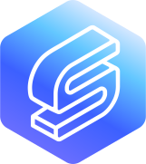

<p align="center"></p>

## About Sharely

Sharely is a mini community platform to share your memories around the world. People can create their memories by posting lifestyle and share to friends also follow friend gaining some small tips to make a happier lifestyle.

- Authentication and Authorization system
- Password Reset
- Follow and Following system
- Like and Unlike system
- Comment system
- Customize User Profile system
- Image Upload
- Notification system
- Email System

## Background

The Application are develop by myself in 3 month to learning php and the framework laravel and develop it. Laravel is a really nice framework for developers like easily creating authentication system by using laravel breeze and also database's eloquent orm really save so much time. On the styling, im comfortable on tailwind css and luckily its work very well with laravel.

That's it, im sure it was a great adventure for myself!

## Technology

- [Laravel](https://laravel.com/)
- [Tailwind](https://tailwindcss.com/)
- [lottie](https://lottiefiles.com/)
- [mysql](https://www.mysql.com/)

## Installation

The web application need to run by [docker](https://www.docker.com/). The application is develop on apple silicon that are running arm64 if your machine is running on x86 maybe need modify docker-compose.yml and remove arm64v8 and platform linux/amd64. Be sure go check them out if you don't have them.

## Usage

To run the application, please following the steps:

1. Clone the project
```shell
$ git clone https://github.com/destiny0114/nutritionx.git
```

2. Run the docker compose, before that make sure valet are disabled and stop any application that are run on port 8000
```shell
$ docker-compose up
```

3. Access docker container
```shell
$ docker exec -it app bash
```

4. Copy and create environment file
```shell
$ cp .env.example .env
```

5. Install dependencies
```shell
$ composer install && yarn install
``` 

6. Laravel commands
```shell
$ php artisan key:generate // generate key on application
$ php artisan optimize // cache env file
$ php artisan migrate // database migrate
$ php artisan storage:link // link storage to public for access image
```

7. View the website at: http://localhost:8000. Thats it!

## Contributing

Thank you for considering contributing to the Laravel framework! The contribution guide can be found in the [Laravel documentation](https://laravel.com/docs/contributions).

## License

The Laravel framework is open-sourced software licensed under the [MIT license](https://opensource.org/licenses/MIT).
